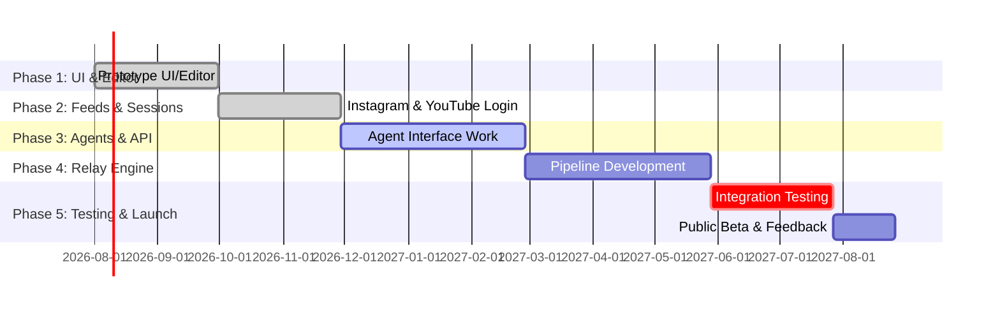

# Executive Summary  
This report outlines a design and implementation plan for a Brainrot IDE – a custom VS Code/Electron-based coding app that simultaneously lets users browse Instagram Reels and YouTube Shorts while AI assistants write and test code. We assume an Electron/VSCode OSS foundation (JavaScript/TypeScript, Node.js, Chromium) to maximize compatibility with existing VS Code extensions and the Monaco editor. Key components include: an embedded Monaco editor (or VSCode workbench), a “Brainrot” layer with webviews for social feeds, and a multi-agent **Relay Engine** pipeline that orchestrates planning, code implementation, review, and testing. Security and compliance are carefully managed: user credentials and cookies are stored in the platform’s secure session (Electron’s default session is persistent across restarts), and API keys are held in OS-backed secure storage (e.g. using keytar). We analyze architecture alternatives (Electron vs. Tauri), target platforms (Windows/macOS/Linux), plugin design, OAuth/session management, and legal/privacy issues (YouTube/Instagram terms). The recommended stack is Electron + VSCode OSS (MIT license) plus Node for backend logic, with future options to migrate to Tauri if footprint or security demands increase. We include a phased roadmap with milestones, estimated effort, and team roles.

## Architecture Overview  
The app will be a cross-platform desktop application (Windows, macOS, Linux) based on VS Code’s architecture: a Chromium-embedded UI with Node.js backend. Architecturally, the **Electron main process** handles OS integration (menus, windows, auto-update, IPC), while **renderer processes** run the UI (Monaco editor and webviews). We embed a Monaco or VSCode workbench instance for code editing. The Brainrot UI layer consists of multiple webviews or BrowserViews showing Instagram Reels and YouTube Shorts side-by-side or tabbed. We use secure communication via Electron’s IPC modules between main and renderer. An example high-level diagram is shown below:

 *Figure: High-level architecture (Electron main/renderer with code editor and feed webviews, AI agent layer, storage).*  

- *Cross-platform:* Electron (Chromium+Node) works on Windows, macOS, Linux. Alternative Tauri (Rust + OS WebView) offers smaller bundles but lacks mature VSCode integration. Given user preference and immediate availability of VSCode OSS, Electron is chosen.  
- *Editor:* Use the VSCode OSS codebase or embed Monaco editor in Electron. VSCode is MIT-licensed (open-source) and built on Electron. We can drop the VS Code “Workspaces” model or use VSCode’s Extension Host to allow plugins.  
- *Webviews:* For feeds, we can use Electron’s `<webview>` tags or BrowserView (now WebContentsView in Electron 30+) to host the Instagram and YouTube sites. The key difference is that `<webview>` is a sandboxed DOM element (Node disabled by default), suitable for untrusted content, while BrowserWindows (or BrowserViews) give a full browser context. Embedding multiple webviews in the main window lets users scroll feeds in a shared layout. (See “UI Options” table below.)  
- *Agent Layer:* AI models run as separate services or microtasks. Agents (Claude, Codex, etc.) are not compiled into the UI; they communicate over HTTPS to their respective APIs. We maintain a **Relay Engine** process (Node services) that coordinates multi-model calls.  
- *Storage:* Local files and databases store state. User code and AI “solutions” are saved in a local `.solutions/` folder. Session data (cookies, OAuth tokens) use Electron’s session module (persistent by default). API keys are stored encrypted via the OS keychain (e.g. with node-keytar).  

## User Interface & Editor  
The UI has two main panels: a code editor (Monaco/VSCode workbench) and a Brainrot feed area. The editor is implemented via the open-source Monaco editor (the core of VSCode) embedded in Electron. We can use React or plain HTML/CSS for the surrounding UI. Key features:  
- **Code Editing:** Syntax highlighting, IntelliSense, extensions support (via VSCode Extension API). We may bundle or allow installing popular extensions (Git, formatting, etc.).  
- **Feed Controls:** Buttons or tabs to switch between Instagram and YouTube feeds. Each feed runs in its own `<webview>` or BrowserView. The user’s Instagram/YouTube accounts can be logged in once and retained. Scrolling the feeds is done via injected JavaScript in the webviews, controlled by UI buttons (e.g., “Scroll” or “Pause”). As soon as an AI agent completes its task, the feeds automatically pause.  
- **Status/Notifications:** A small overlay or status bar shows agent progress (e.g. “Planning…”, “Coding…”, “Testing…”). When the agent finishes successfully, a fun “Mission Complete” animation (confetti, a checkmark, etc.) plays and the user can review the code.  

## Plugin System & Agent Integration  
To allow future extensibility, the app supports a plugin architecture (VSCode-compatible). Plugins can add commands or panels. We also design a standard **Agent Interface** to integrate any AI model (Claude, OpenAI Codex, Grok, OpenCode, etc.). In TypeScript, we might define:  
```ts
interface Agent {
  name: string;  
  run(prompt: string, options?: any): Promise<string>;  
  stop(): void;  
  onOutput(callback: (text: string) => void): void;  
  onError(callback: (err: Error) => void): void;  
  onDone(callback: () => void): void;
}
```  
Agents implement `run()` to send prompts to the model API and stream results. They emit intermediate output for live feedback and a final completion. By coding to this interface, we can plug in multiple models and switch at runtime. For example, a ClaudeCode agent might use Claude’s API, while an OpenCode agent uses a community model. We manage API keys per model (BYOK – bring your own key) and allow users to configure them in settings.  

### Table: Integration Options  
| Component              | Options                                     | Pros                                          | Cons                                          |
|------------------------|---------------------------------------------|-----------------------------------------------|-----------------------------------------------|
| **Embedding Editor**   | Monaco Editor (VSCode)                      | Full-featured; rich extensions & ecosystem | Large; heavy for minimal UI                   |
|                        | Ace/CodeMirror                              | Lightweight; easy to embed                    | Lacks VSCode’s advanced features              |
| **Feed Webview**       | Electron `<webview>` tag                    | Sandboxed by default; multiple per window | Complex IPC to main; legacy                   |
|                        | Electron `BrowserView` (WebContentsView)    | Unified Node/renderer context; official API   | Newer (migrating); one-per-window layout      |
|                        | Native Tauri WebView (if ported)            | Smaller footprint (no bundled Chromium) | No VSCode editor support; more work to adapt  |
| **Session Storage**    | `electron.session` (defaultSession)         | Persistent by default; built-in | Manual cookie handling for some flows         |
|                        | In-app DB (SQLite/LevelDB)                  | Structured storage for JSON/data              | Encryption needed for secrets                 |
| **Auth/Creds Storage** | OS Keychain via `node-keytar`| Secure platform-backed storage                | Keys still accessible to user; no absolute security |
|                        | Electron `safeStorage`                      | Built-in data encryption (desktop only)       | Limited API; not cross-OS-friendly            |
| **IPC Methods**        | Electron `ipcMain`/`ipcRenderer`            | Native; synchronous messaging                 | Requires careful channel design               |
|                        | REST/HTTP within app                        | Decoupled; can host as microservice           | More overhead; same-process RPC simpler       |
|                        | Shared Worker (Node child process)          | True parallelism; native node modules         | Complexity managing multiple processes        |

## Relay Engine Pipeline  
At the core is a multi-stage **Relay Engine** pipeline that divides coding tasks into: **Planner → Implementer (Generator) → Reviewer → Tester**. This follows a “planner-generator-evaluator” design. In practice: 
1. **Planning Agent:** Given the user’s instruction, it generates a specification or outline (in Markdown) of the solution. We use a high-capability model (Claude Sonnet or GPT-4o) for this role. The plan is saved to `.solutions/task.md`.  
2. **Implementation Agent:** A code-focused AI (e.g. OpenAI Codex, or an open-source coding model) reads the spec and generates code. It writes a code file or output JSON in the `.solutions/` folder.  
3. **Review Agent:** Another high-capability model (Claude Sonnet/Gemini Flash) reads the generated code and spec, critiques it, and suggests fixes. The reviewer may loop back to the Implementer for corrections, up to a maximum iteration count.  
4. **Tester:** A script or AI writes and runs test cases (unit tests) against the code. If tests pass, pipeline completes; if not, feedback returns to Review.  

This pipeline can be visualized as:

 *Figure: Relay Engine pipeline (Planner → Implementation → Review → Testing).*

- **Role Separation:** By using different agents for planning and reviewing, we avoid the “self-confirmation” bias of a single model checking its own code. The planner and reviewer are strong LMs; the implementer is a fast code model.  
- **.solutions Schema:** Each task spawns a folder `.solutions/<task_id>/` containing:
  - `plan.md`: the specification in Markdown.  
  - `plan.json`: structured plan (if needed).  
  - `code.py` (or .js, etc.): the generated code.  
  - `code.json`: any structured output (functions, classes, AST).  
  - `review.txt`: reviewer notes.  
  - `tests/`: test files.  
This JSON/MD schema lets the UI display results or inspect previous solutions.  

### Pipeline Chart (Mermaid Gantt)  
Below is an example Mermaid timeline for a phased development roadmap (see **Roadmap**). Each block is a milestone (in person-months) – for illustration.  


*(This Gantt chart is conceptual; adjust dates/durations as project requires.)*  

## Security, Privacy, Compliance  
Security is paramount given the use of user credentials and platform APIs. Key considerations:  
- **Session & Cookies:** We rely on Electron’s defaultSession, which persists cookies between runs by default. Users log in to Instagram/YouTube once; the session cookies are stored securely by the OS. We ensure to close the app cleanly (`app.quit()`) so cookies flush to disk.  
- **OAuth & API Keys:** Where possible we use official APIs (e.g. YouTube Data API, Instagram Graph API) with OAuth flows. No user passwords are stored: do *not* collect or store YouTube/Instagram credentials ourselves. If official APIs lack “shorts” or “reels” endpoints, we limit ourselves to webviews. Note: Instagram’s terms explicitly forbid automated scraping or account access, so our app uses *user-driven* webviews only (the user must manually log in and scroll; our buttons inject native scroll commands, which is analogous to a user action). We explicitly warn users about compliance.  
- **Data Handling:** We avoid sending user content or logins to any third-party beyond the official sites. Any telemetry is optional and anonymized.  
- **License/OSS:** Our code is released under a permissive license (e.g. MIT, following VSCode’s license). We comply with open-source requirements (attribution, no proprietary dependencies except Electron).  
- **Legal Risks:** We highlight in documentation that “brainrot” mode is for personal use only; automated crawling or data collection beyond user’s own account is against ToS. We also must comply with GDPR if applicable (no unconsented user data stored).  

## UX Flows & Animations  
The user flow is as follows: the user writes or describes a task in VS Code. They then click an “Run AI” button. The Brainrot feeds start scrolling (via JS injection) to entertain the user. The app shows a “Working…” overlay. Upon agent completion, the scrolling stops. The UI then plays a fun animation (e.g. confetti, a robot icon, or a “Mission Accomplished” pop-up) to signal success. The user can then inspect the code in the editor and run tests. Failure cases (errors or review feedback) are shown as red banners or console messages. 

Animations and graphics should be light and optional. For example, a quick overlay with an emoji, or a fireworks CSS effect, adds delight without distracting from coding. The UX is inspired by developer tools but with a playful twist.  

## CI/CD, Packaging & Updates  
We will set up a standard CI pipeline (GitHub Actions) to lint/compile, run tests, and build packages for each OS. Packaging uses **electron-builder** or similar to produce installers (DMG for macOS, MSI/EXE for Windows, AppImage or Flatpak for Linux). We enable auto-updates (Squirrel or GitHub Releases) so users get the latest features. Every build is signed with our code-signing certificates (to avoid OS warnings).  

**Development Workflow:** Use a monorepo with TS. E.g. folders: `src/main/` (Electron main process), `src/renderer/` (UI), `src/agents/` (worker orchestration), `src/extensions/` (VSCode plugin integration). Tests are implemented with Jest (for Node) and Playwright or Cypress (for UI automation).  

## Roadmap & Team Roles  

- **Phase 1 (1–2 PM):** *UI Prototype* – Build basic editor and feed layout (Team: 1 frontend/Electron dev).  
- **Phase 2 (1–2 PM):** *Feed/Session* – Integrate Instagram and YouTube webviews, login persistence (Team: 1 frontend, 1 QA).  
- **Phase 3 (2–3 PM):** *Agent Interfaces* – Implement API client code for Claude, Codex, etc. Design `.solutions` schema (Team: 1 fullstack/AI dev, 1 backend).  
- **Phase 4 (3–4 PM):** *Relay Engine* – Develop the planner-implementer-reviewer pipeline with retry/escalation logic (Team: 1 AI engineer, 1 fullstack dev).  
- **Phase 5 (2 PM):** *Testing & Polishing* – End-to-end testing, performance tuning, packaging, documentation (Team: 1 QA, 1 devops).

Total: ~9–13 person-months. **Team:** 2–3 core engineers (mix of Electron/JS and AI prompt specialists), plus 1 QA/DevOps.    

## References  
Authoritative sources guided this design: VS Code’s documentation and architecture analyses; Electron docs and forums for session/cookie persistence; comparative studies of Electron vs. Tauri; AI multi-agent design patterns; and YouTube/Instagram developer terms and policies. Further details can be refined during implementation, but this plan provides a comprehensive blueprint for the Brainrot IDE project.